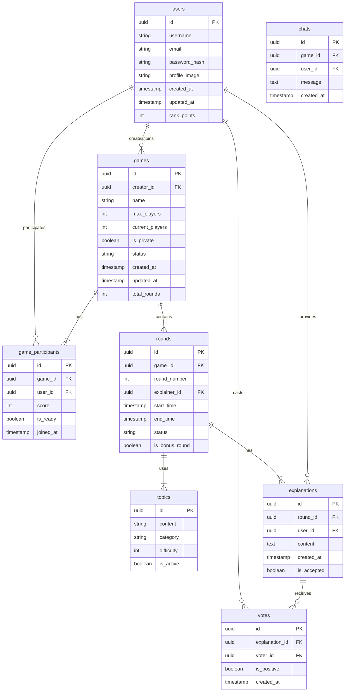

# Anti-Rummikub: Improv Showdown – 데이터베이스 설계 (ERD)

---

## 1. ERD 다이어그램 (Mermaid)

---

## 2. 테이블 및 관계 설명

### 사용자 및 게임 관리

- **users**: 플레이어 계정 정보, 랭킹 포인트
- **games**: 게임방 기본 정보(이름, 인원, 상태 등)
- **game_participants**: 게임-유저 M:N 관계, 점수 기록

### 게임 진행

- **rounds**: 각 게임의 라운드 정보, 설명자, 시작/종료 시간
- **topics**: 주제 카드(콘텐츠, 카테고리, 난이도)
- **explanations**: 설명자가 제공한 설명 내용
- **votes**: 특정 설명에 대한 투표 기록

### 부가 기능

- **chats**: 게임 내 채팅 기록

---

## 3. 인덱싱 및 성능 최적화

- 주요 쿼리 패턴에 맞춘 인덱스:
  - `games(status, created_at)`: 활성 게임 검색
  - `game_participants(user_id, game_id)`: 유저별 참여 게임
  - `votes(explanation_id)`: 설명별 투표 집계

---

## 4. 데이터 마이그레이션 전략

- 초기 스키마 구축: `migrations/001_initial_schema.sql`
- 버전별 롤백 전략: 각 마이그레이션 스크립트에 `up`/`down` 메소드 구현
- CI/CD 파이프라인에 마이그레이션 자동화 통합
